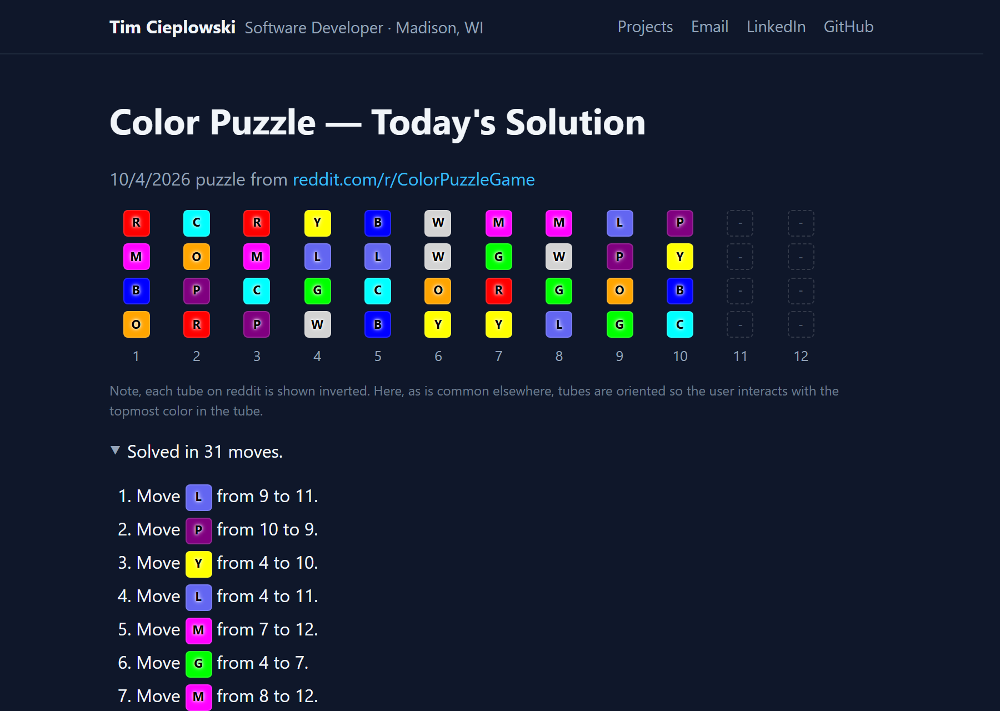

# Color Puzzle Solver

**Live site: https://timteachesmath.github.io/color-puzzle-solver/**

Every morning this solves the daily [r/ColorPuzzleGame](https://www.reddit.com/r/ColorPuzzleGame/)
puzzle in the fewest possible moves and publishes the solution. The page also
runs the same solver in the browser, so users can type in any board and solve it.



## Highlights

- **One solver, two runtimes.** The A* search is written once in TypeScript.
  The browser imports it as an ES module; the Python pipeline calls the same
  compiled code through a small Node CLI.
- **Shortest solutions.** The heuristic (color segments still to be
  merged) never overestimates the moves left, so A* returns an optimal
  solution. Backed by a hand-written binary heap and unit tests.
- **Framework-free front end.** Plain HTML, CSS and JavaScript ES modules with
  no build step for the page. Each board is a CSS grid sized from the puzzle's
  own tube depth, colors carry letter codes for colorblind players, boards
  have spoken descriptions for screen readers, and status messages are
  announced via `aria-live`. The stylesheet and header are shared with my
  other project pages.
- **Hands-off publishing.** A scheduled job fetches and solves the puzzle,
  commits the result, and GitHub Actions runs the tests and redeploys the site.

**Stack:** HTML · TypeScript · Node test
runner · Python · Playwright · GitHub Actions · GitHub Pages

## How it works

Reddit no longer offers self-service API keys, so the pipeline reads the
daily post with Playwright using a saved, logged-in browser session:

1. `scraper/auth.py` — one-time interactive login that saves the browser
   session to `reddit_state.json`.
2. `scraper/fetch_post.py` — reuses that session to find the newest post
   in the subreddit.
3. `scraper/extract_board.py` — loads the post (the game itself renders
   inside a Devvit webview iframe), turns on the puzzle's colorblind mode
   so each color's letter code is written into the page, and reads those
   letters into a board.
4. `solver-ts/src/solver.ts` — the search algorithm (compiled to
   `site/js/solver.js`). `solver/astar.py` calls the compiled Node CLI
   (`site/js/cli.js`, from `solver-ts/src/cli.ts`) rather than
   reimplementing it in Python, so the daily pipeline and the browser
   share one implementation instead of two hand-kept-in-sync copies.
5. `main.py` — runs 1–4 and writes `site/solutions/YYYY-MM-DD.json`.
6. `site/index.html` — static page that fetches today's JSON and renders
   the moves, and also imports `site/js/solver.js` directly (as an ES
   module) to power the "Solve Your Own Puzzle" field. The page never
   calls Reddit; it only reads a same-origin JSON file.

## Setup (local)

```bash
python -m venv venv
source venv/bin/activate   # Windows: venv\Scripts\activate
pip install -r requirements.txt
playwright install chromium
cp .env.example .env       # defaults are fine unless you want a different subreddit
```

Build the shared TypeScript solver (needed before `main.py` or `site/index.html` will work — both depend on `site/js/solver.js` / `site/js/cli.js`):

```bash
npm install -g typescript   # global install — see note below
cd solver-ts
npm run build                # compiles src/*.ts to ../site/js/*.js
cd ..
```

**Global install, not local:** a local `npm install` inside `solver-ts/`
reliably corrupts (0-byte files in `node_modules`) in this Google
Drive-synced folder — Drive's sync appears to interfere with npm's rapid
small-file writes during extraction. Installing TypeScript globally
(outside the synced folder, under npm's global prefix) avoids it. Rerun
`npm run build` in `solver-ts/` any time you change `solver-ts/src/*.ts`.

Then create your browser session (needed before the scraper will work):

```bash
python -m scraper.auth
```

A real browser window opens to the Reddit login page. Log in manually, then
press Enter in the terminal once you're on your homepage. This saves
`reddit_state.json`, which `fetch_post.py` and `extract_board.py` both reuse.
**Never commit this file** — it's login session data (already in
`.gitignore`). It will expire eventually; re-run `scraper.auth` when runs
start failing with a "no saved Reddit session" error.

Run the full pipeline:

```bash
python main.py
```

This writes `site/solutions/YYYY-MM-DD.json`. To see the page, serve `site/`
locally (opening `index.html` straight from disk won't work, because browsers
block ES module imports and `fetch` from `file://` pages):

```bash
python -m http.server 8000 --directory site
```

Then open http://localhost:8000.

## Running the tests

```bash
cd solver-ts
npm test               # type-check + solver tests
npm run format:check   # Prettier
```

`npm test` runs `solver-ts/src/solver.test.ts` via Node's built-in test
runner (`node --test` — no test framework dependency needed). Covers
`solveBoard` (exact move counts on known boards, each independently verified
by replaying the moves and confirming the board actually ends up sorted,
plus edge cases like an already-solved board and the search timeout) and
`IndexMinHeap` (ordering, tie-breaking, size tracking). Test files are
excluded from `tsc`'s build (`solver-ts/tsconfig.json`), so they never end
up in the deployed `site/js/`.

The scraper's board validation has its own check, run from the repo root:

```bash
python -m tests.test_validation
```

GitHub Actions runs the type-check, solver tests and format check on every
push that touches the site or solver, and also confirms the committed
`site/js/` matches a fresh build. The deploy only runs if they pass.

## Daily automation

The pipeline runs on a local Windows Task Scheduler job, which commits each
new solution and pushes it to trigger the deploy. It runs locally rather than
in GitHub Actions so the Reddit login session never leaves this machine.
Setup steps are in [docs/daily-automation.md](docs/daily-automation.md).
